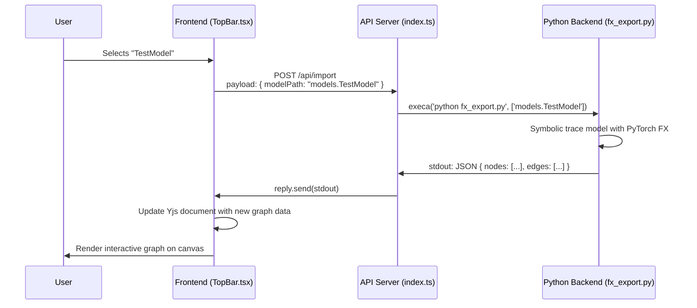
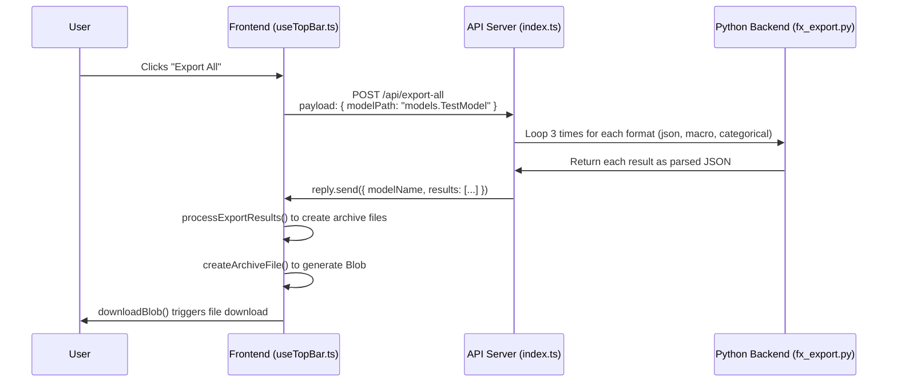

# VisuaML Architecture

This document provides a comprehensive and accurate overview of VisuaML's architecture, design patterns, and system organization, updated to reflect the current state of the codebase.

## 🏗️ System Overview

VisuaML is a full-stack application for visualizing and exporting PyTorch neural networks. The system consists of three main components that communicate via a well-defined API.

```
┌─────────────────┐      ┌─────────────────┐      ┌─────────────────┐
│   Frontend      │      │   API Server    │      │   Backend       │
│   (React/TS)    │◄─────►│   (Node.js)     │◄─────►│   (Python)      │
│                 │      │                 │      │                 │
│ • React Flow    │      │ • Fastify       │      │ • PyTorch FX    │
│ • Material-UI   │      │ • Zod           │      │ • Model Export  │
│ • Yjs Collab    │      │ • CORS          │      │ • Hypergraphs   │
│ • Zustand       │      │ • Error Handling│      │ • Shape Prop    │
└─────────────────┘      └─────────────────┘      └─────────────────┘
```
-   **Frontend**: A modern React application built with Vite, TypeScript, and Material-UI for a rich, interactive user experience.
-   **API Server**: A lightweight Node.js server using Fastify to handle requests, validate inputs with Zod, and orchestrate the Python backend.
-   **Backend**: A powerful Python environment that uses PyTorch's FX library to symbolically trace models and export their architecture without requiring modifications to the source code.

## 📁 Directory Structure

The `visuaml-client` package contains the entire application stack, organized as follows:

```
visuaml-client/
├── backend/                  # Python model processing
│   ├── scripts/              # CLI scripts (e.g., fx_export.py)
│   ├── visuaml/              # Core export library
│   ├── models/               # Example PyTorch models
│   ├── examples/             # Standalone example scripts
│   └── tests/                # Pytest tests for the backend
├── server/                   # Node.js API server
│   └── index.ts              # Fastify server with all API endpoints
├── src/                      # Frontend React application (Vite)
│   ├── ui/                   # React components (TopBar, Canvas, Nodes)
│   ├── lib/                  # Core utility functions (api.ts, etc.)
│   ├── store/                # Zustand global state management
│   ├── y/                    # Yjs real-time collaboration logic
│   ├── assets/               # Static assets like images or fonts
│   └── __tests__/            # Frontend tests
├── public/                   # Static assets served by Vite
├── .env.example              # Template for environment variables
├── ARCHITECTURE.md           # This file
├── MULTIPLAYER.md            # In-depth guide to the collaboration features
├── package.json              # Project dependencies and scripts
└── vite.config.ts            # Vite build configuration
```

## 🔄 Data Flow Diagrams

### 1. Model Import Flow

The user selects a model, triggering a request that flows through the stack to trace the model and return a visual graph.



### 2. "Export All" Flow

The user requests an archive of all possible formats for a model.



## 🔐 Authentication & User Presence

The application uses an (optional) hybrid approach to identify users for collaboration, seamlessly integrating **Clerk** for authentication with **Yjs** for presence.

1.  **Connection**: A user connects to the `YDocProvider`.
2.  **Authentication Check**:
    *   **If signed in via Clerk**: The user's real name and a unique color derived from their user ID are broadcast to the Yjs awareness state.
    *   **If not signed in (Guest)**: A guest name (e.g., "Guest 123") and a unique color are generated based on their random Yjs `clientID`.
3.  **Presence Display**: The `useRemoteCursors` hook reads the awareness state and renders the cursors and names of all other connected users, ensuring every collaborator is clearly identified.

This creates a smooth experience where users can collaborate whether they are logged in or not.

## 🎨 Frontend Architecture

The frontend is a modern React SPA using Vite for a fast development experience.

### Key Libraries & Patterns

-   **Component Framework**: **Material-UI** provides the core set of polished UI components.
-   **Component-Scoped Styling**: **CSS Modules** are used for styling individual components (e.g., `Canvas.module.css`), preventing style conflicts.
-   **Graph Visualization**: **React Flow** is used to render and manage the interactive node-based graph.
-   **3D Visualization**: **React Three Fiber** and `drei` are used for rendering 3D tensor visualizations within nodes.
-   **State Management**:
    *   **Zustand (`store/`)**: For simple, global client state (like network statistics).
    *   **Yjs (`y/`)**: For complex, shared/collaborative state (graph nodes, edges, cursor positions).

### Design Patterns

-   **Custom Hooks (`use...`)**: Component logic is encapsulated in custom hooks (`useTopBar`, `useCanvas`) to keep JSX clean and promote reusability.
-   **Utility Modules (`lib/`)**: Pure, testable functions for concerns like API calls, data processing, and layout calculations are kept in the `lib` directory.
-   **Type-First Development (`*.model.ts`)**: TypeScript interfaces and types are defined in `*.model.ts` files, providing a clear data contract before implementation.

## 🔧 Backend Architecture

The backend consists of two main parts: a Node.js server that acts as an orchestrator and a Python environment that performs the heavy lifting of model analysis.

### Node.js API Server (`server/index.ts`)

-   **Framework**: **Fastify** is used for its high performance and low overhead.
-   **Responsibilities**:
    1.  **Receive Requests**: Listens for HTTP requests from the frontend.
    2.  **Validate Inputs**: Uses **Zod** to parse and validate request bodies, ensuring type safety at the edge.
    3.  **Orchestrate Backend**: Spawns the Python script (`fx_export.py`) as a child process using `execa`.
    4.  **Format & Relay Responses**: Captures `stdout` from the Python script and relays it back to the frontend.
-   **Error Handling**: Provides detailed JSON error messages for both validation failures and script execution errors.

### Python Backend (`backend/`)

-   **Core Technology**: **PyTorch FX** is used for its powerful symbolic tracing capabilities. This allows VisuaML to analyze a model's `forward` pass and construct a graph representation (a `GraphModule`) without the user needing to modify their model code.
-   **Processing Pipeline**:
    1.  **Load Model**: Dynamically loads the user-specified model class from the `models` directory.
    2.  **Symbolic Trace**: `symbolic_trace(model)` is called to produce the FX graph.
    3.  **Shape Propagation**: A sample input tensor is passed through the graph to infer the output shape of each layer.
    4.  **Export Generation**: The FX graph is traversed, and its nodes and edges are converted into one of the supported output formats (JSON, Rust macro, etc.).
    5.  **Output**: The final result is printed to `stdout` as a JSON string, which is then captured by the Node.js server.

## 🧪 Testing Strategy

-   **Frontend (`src/__tests__`)**: Unit and component tests are structured with Vitest and React Testing Library.
-   **Backend (`backend/tests/`)**: The Python backend is tested using `pytest`. Tests cover model loading, export formats, and the correctness of the generated graph structures.
-   **E2E/Integration**: A small set of Python scripts (e.g., `test_export_frontend.py`) can be run to perform end-to-end tests against the live API server.